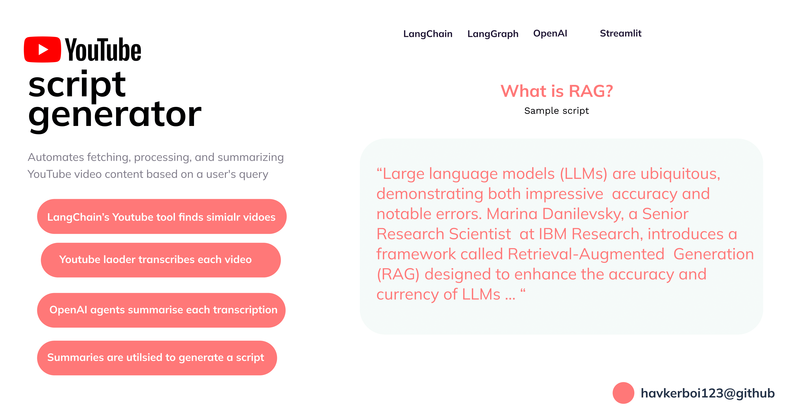

# Youtube video script generator



While learning LangGraph , I devolped this tool for my youtuber friend to help him with video scripts. The tool uses LangGraph routing along with OpenAI's LLM and LangChain's youtube tool.

The workflow is described below : 

The workflow begins by using a YouTube search tool to retrieve video URLs based on a query and a specified number of top results.

If there are existing documents, it proceeds to extract and process the text from these videos using a YouTube loader. If the document count is sufficient, the workflow generates a summary of the video content; otherwise, it goes back to retrieving more video URLs. 

The summarization process involves creating a detailed summary and refining it by incorporating new key points if necessary. The entire process is managed through a state graph, ensuring that each step is executed based on the current state and conditions.

The LangGraph nodes include:

```python
workflow.add_node("get_youtube_video_urls", get_youtube_video_urls)
workflow.add_node("get_video_text_from_urls", get_video_text_from_urls)
workflow.add_node("get_text_summary", get_text_summary)
```

The edge logic is made somewhat like this :

```python
workflow.set_entry_point("get_youtube_video_urls")
workflow.add_edge("get_youtube_video_urls", "get_video_text_from_urls")
workflow.add_conditional_edges(
    "get_video_text_from_urls",
    decide_to_get_summary,
    {
        "get_text_summary": "get_text_summary",
        "get_youtube_video_urls": "get_youtube_video_urls",
    },
)
```
All in all this was a fun project to work on , made me learn some efficient routing workarounds.


